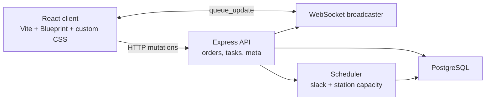

<p align="center">
  
</p>

<h1 align="center">Pansear</h1>

<p align="center">
  A 2000s-style kitchen operations system for routing orders, prioritizing station work, and keeping the line moving.
</p>

---

## What It Does

Pansear is a kitchen-side order scheduler. It takes incoming tickets, breaks them into station tasks, and tells each station what to cook next based on promise time, cook time, current capacity, and queue pressure.

The UI intentionally feels like an old corporate intranet: beveled controls, dense tables, blue title bars, Verdana, and practical kitchen-first screens.

## Highlights

- **Live kitchen overview** - see pending, cooking, capacity, and next-up status by station.
- **Station work screens** - each station gets a focused "cook this next" view.
- **Active orders rail** - order status stays visible in the left frame while cooks move between pages.
- **Promise-time feasibility checks** - warns when a new order cannot realistically be completed on time.
- **Projected ETAs** - estimates task and ticket completion based on the current queue.
- **Capacity controls** - station capacity can be adjusted during service.
- **Realtime updates** - WebSocket broadcasts keep every screen in sync.
- **Seed data and simulator** - quickly populate the kitchen with demo orders.

## Tech Stack

| Area | Stack |
| --- | --- |
| Client | React, TypeScript, Vite, Blueprint UI |
| Server | Node.js, Express, TypeScript |
| Database | PostgreSQL |
| Realtime | WebSockets |
| Shared contracts | TypeScript workspace package |
| Styling | Custom CSS with a late-90s / early-2000s intranet theme |

## Repository Layout

```text
.
|-- packages
|   |-- client      # React/Vite frontend
|   |-- server      # Express API, WebSocket server, scheduler, migrations
|   `-- shared      # Shared TypeScript types
|-- docker-compose.yml
|-- package.json
`-- README.md
```

## App Routes

| Route | Purpose |
| --- | --- |
| `/overview` | Kitchen overview by station |
| `/new-order` | Create a new ticket |
| `/station/1` | Grill station |
| `/station/2` | Fryer station |
| `/station/3` | Cold station |

`/expo` redirects to `/overview`; active orders now live in the persistent left-side frame.

## Getting Started

### 1. Install dependencies

```bash
npm install
```

### 2. Start PostgreSQL

Pansear defaults to:

```text
host: localhost
port: 5432
database: kitchen
user: kitchen
password: kitchen
```

With Homebrew PostgreSQL:

```bash
brew install postgresql@16
brew services start postgresql@16

createuser -s kitchen
createdb -O kitchen kitchen
psql -d kitchen -c "ALTER USER kitchen WITH PASSWORD 'kitchen';"
```

You can override connection settings with:

```text
PGHOST
PGPORT
PGUSER
PGPASSWORD
PGDATABASE
```

### 3. Run migrations

```bash
npm run migrate
```

Migrations are idempotent and include seed data.

### 4. Start the app

```bash
npm run dev
```

This starts:

- API/WebSocket server on `http://localhost:3001`
- Vite client on `http://localhost:5173`

If port `5173` is already in use, Vite will choose the next available port.

## Demo Orders

In another terminal, generate sample kitchen traffic:

```bash
npm run simulate -w packages/server -- --orders 20
```

## Docker Database Option

You can use the included Docker Compose file instead of a local Homebrew PostgreSQL service:

```bash
docker compose up -d
PGPORT=5433 npm run migrate
PGPORT=5433 npm run dev
```

The compose file maps host port `5433` to the container's PostgreSQL port.

## Testing

```bash
npm test
```

The scheduler tests live in `packages/server/src/scheduler.test.ts`. The scheduler is the core decision engine for station priority and slack calculations.

## Architecture



Every order/task mutation runs the scheduler and broadcasts a fresh `queue_update` to connected clients. Shared TypeScript types in `packages/shared` keep the client and server contracts aligned.

## Development Notes

- Keep UI changes consistent with the old intranet theme.
- Prefer compact, table-like layouts over modern dashboard cards.
- The client build is static; the server owns API routes, scheduling, persistence, and WebSocket updates.
- `packages/client/tsconfig.json` uses `noEmit` so type-checking does not generate stray `.js` files in `src`.
